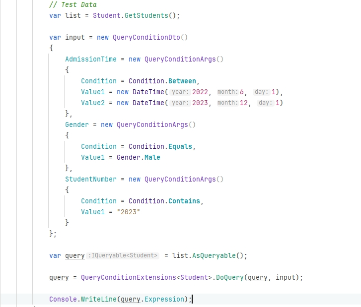

# 构建动态表达式
## dynamic-expression



> 根据input的输入构建的表达式如下：

```aiignore
System.Collections.Generic.List`1[DynamicExpression.Models.Student]
.Where(Param_0 => (Param_0.AdmissionTime >= 2022-06-01 00:00:00))
.Where(Param_0 => (Param_0.AdmissionTime <= 2023-12-01 00:00:00))
.Where(Param_1 => (Param_1.Gender == Male))
.Where(Param_2 => Param_2.StudentNumber.Contains("2023"))
```